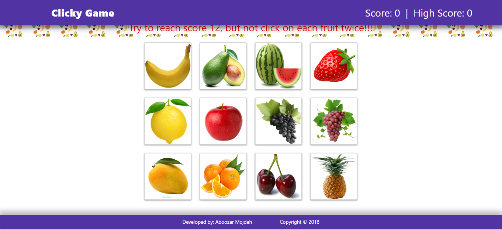

# Clicky Guss Card Game

A front end react app memory game! Try to click on all the characters without repeating yourself.
try out the game here: 
* [Clicky Game on Heroku](https://clickygamereactaboozar.herokuapp.com/)
* [Clicky Game on Github](https://aboozarmojdeh.github.io/Clicky-Game-React/)

## Prerequesites

* [Node](https://nodejs.org/en/)
* [git](https://git-scm.com/downloads) (windows) or Terminal (mac)

## Installation

1. Navigate to a project direcotry on your machine where you want to clone the repository
2. run the command in the terminal:
    * `git clone https://github.com/aboozarmojdeh/Clicky-Game-React.git`
3. change directory into the newly cloned project:
    * `cd Clicky-Game-React`
4. install the node dependenices:
    * `npm install`
    * there are a few large packages in this project, dont be alarmed if the install takes a minute or two.
5. start the react app with:
    * `npm run start` or
    * `yarn start`

## Built with

* [React](https://reactjs.org/)
* [Bootstrap](http://getbootstrap.com/docs/4.1/getting-started/introduction/)

## Author

Aboozar Mojdeh